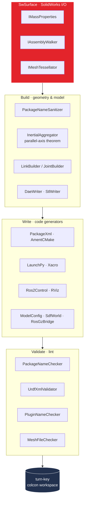

# Contributing to SW2GZ

## License header for new files

Any new .cs file added in this fork uses this header:

```csharp
/*
Copyright (c) 2026 Aryan Arlikar

Permission is hereby granted, free of charge, to any person obtaining a copy
of this software and associated documentation files (the "Software"), to deal
in the Software without restriction, including without limitation the rights
to use, copy, modify, merge, publish, distribute, sublicense, and/or sell
copies of the Software, and to permit persons to whom the Software is
furnished to do so, subject to the following conditions:

The above copyright notice and this permission notice shall be included in
all copies or substantial portions of the Software.

THE SOFTWARE IS PROVIDED "AS IS", WITHOUT WARRANTY OF ANY KIND, EXPRESS OR
IMPLIED, INCLUDING BUT NOT LIMITED TO THE WARRANTIES OF MERCHANTABILITY,
FITNESS FOR A PARTICULAR PURPOSE AND NONINFRINGEMENT.  IN NO EVENT SHALL THE
AUTHORS OR COPYRIGHT HOLDERS BE LIABLE FOR ANY CLAIM, DAMAGES OR OTHER
LIABILITY, WHETHER IN AN ACTION OF CONTRACT, TORT OR OTHERWISE, ARISING FROM,
OUT OF OR IN CONNECTION WITH THE SOFTWARE OR THE USE OR OTHER DEALINGS IN
THE SOFTWARE.
*/
```

Files inherited from upstream `ros/solidworks_urdf_exporter` keep their
original `Copyright (c) 2015 Stephen Brawner` header verbatim per the MIT
license. Never delete or alter those headers.

## Branching

- `main` — stable, releases tagged `v1.0.0`, `v1.1.0`, …
- Feature branches: `feat/<short-name>`
- Bug branches: `fix/<short-name>`

## Commits

Conventional Commits format:
- `feat:` new feature
- `fix:` bug fix
- `chore:` housekeeping (deps, build, ignored files)
- `refactor:` no behavior change
- `test:` tests only
- `docs:` documentation
- `ci:` CI workflow changes

## Tests

Pure-C# writer tests run anywhere — no SolidWorks needed:

```bash
dotnet test Test/SW2GZ.Writers.Test.csproj --filter "Category=Unit"
# 50/50 passing
```

SolidWorks-dependent integration tests require a workstation with SolidWorks installed and run via the `TestRunner/` standalone exe (see `TestRunner/README.md`).

## Architecture

Robot Package mode runs a layered pipeline. SolidWorks I/O sits behind interfaces, so the
Build / Write / Validate layers are fully unit-testable without SolidWorks installed.



The pipeline emits `<outputDir>/<pkg>_ws/src/<pkg>/...`, so the output is a ready
`colcon build` workspace.

## Project status

| Area | Status |
|---|---|
| Rebrand + remove ROS 1 / Gazebo Classic | done |
| TargetProfile (ROS 2/Gz lookup tables) | done, 9 tests |
| ROS 2 writers (PackageXml, AmentCMake, LaunchPy, Xacro, Ros2Control, RViz) | done, 19 tests |
| Gz writers (ModelConfig, PluginTags, PhysicsBlock, SdfWorld, SdfModel, RosGzBridge) | done, 13 tests |
| Sw2gzPipeline orchestrator + ExportHelper branching | done |
| UI selectors (Sw2gzProfileDialog) | done |
| OutputValidator + PreExportReport | done, 5 tests |
| Golden-file tests | done, 3 profiles |
| Inno Setup installer | done |
| Example output package (3-DOF arm) | done |
| GitHub Actions CI (build + ros2-validate + release) | done |
| Acceptance: real assembly → build → spawn in Gz | manual — needs SolidWorks workstation |
