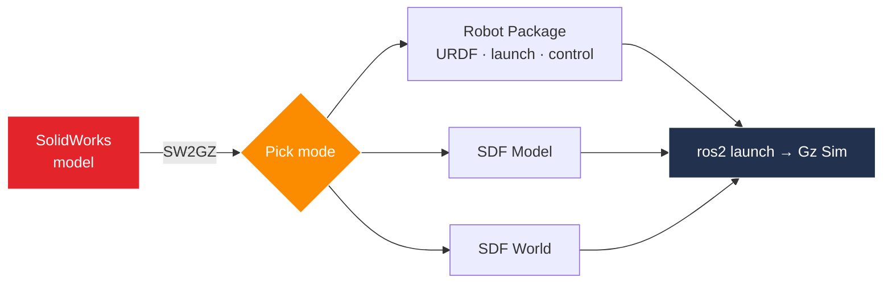

<div align="center">

# SW2GZ

### SolidWorks → ROS 2 + Gz Sim Exporter

Turn a SolidWorks assembly into a ready-to-launch ROS 2 package or Gz Sim model —
meshes, URDF/Xacro, SDF, and launch files generated for you.

[](LICENSE)
[](https://github.com/Aryan01b/SW2GZ/releases/latest)
[](https://github.com/Aryan01b/SW2GZ/releases/latest)
[](#supported-targets)

</div>



## Install

1. Download the latest **`SW2GZ-Setup`** installer from the
   [Releases](https://github.com/Aryan01b/SW2GZ/releases/latest) page.
2. Run it **as administrator**.
3. In SolidWorks, open `Tools → Add-Ins` and enable **SW2GZ**.

Installs alongside the original SW2URDF add-in — both can run together.

## Usage

1. Open an assembly in SolidWorks.
2. `Tools → SW2GZ → Export to ROS 2 / Gz`.
3. Pick a mode, ROS 2 distro, Gz version, and output folder.
4. Configure the link tree, then **Finish Export**.
5. Build and launch:

```bash
cd <output>/<robot>_ws && colcon build
ros2 launch <robot>_description gz_sim.launch.py
```

## Export modes

| Mode | What you get |
|---|---|
| **Robot Package** | Full ROS 2 package: URDF/Xacro, launch files, `ros2_control` config, RViz, a world |
| **SDF Model** | Standalone Gz model: `model.config`, `model.sdf`, meshes |
| **SDF World** | Standalone Gz world with physics, sun, and ground plane |

## Supported targets

ROS 2 distro and Gz version are paired automatically:

| ROS 2 Distro | Gz Version |
|---|---|
| Humble | Fortress |
| **Jazzy** | **Harmonic** *(default)* |
| Kilted | Ionic |
| Rolling | Harmonic |

## Example

[`examples/three_dof_arm_ros2/`](examples/three_dof_arm_ros2/) is a package SW2GZ produced
from the bundled 3-DOF arm (Jazzy + Harmonic).

## More

- **Build from source:** [BUILD.md](BUILD.md)
- **Contributing & internals:** [CONTRIBUTING.md](CONTRIBUTING.md)
- **Release history:** [CHANGELOG.md](CHANGELOG.md)

## Credits

A modernized derivative of
[`solidworks_urdf_exporter`](https://github.com/ros/solidworks_urdf_exporter) by Stephen
Brawner. The ROS 2 + Gz Sim port, new writers, installer, and tooling are by **Aryan Arlikar**.

## License

MIT — see [LICENSE](LICENSE). Third-party components: [THIRD-PARTY-LICENSES.md](THIRD-PARTY-LICENSES.md).

> "SolidWorks" is a trademark of Dassault Systèmes; SW2GZ is independent and not affiliated
> with or endorsed by Dassault Systèmes.
