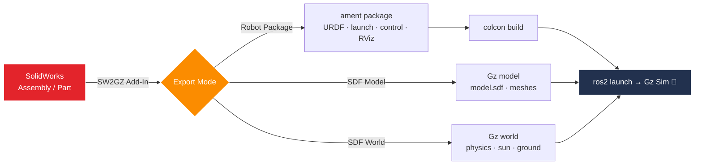
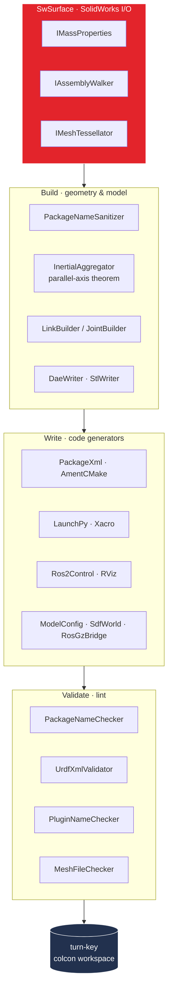
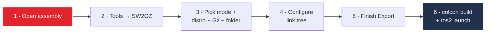

<div align="center">

# SW2GZ

### SolidWorks → ROS 2 + Gz Sim Exporter

Export SolidWorks assemblies and parts into **ready-to-launch ROS 2 packages** and
**Gz Sim** (new Gazebo) assets — meshes, URDF/Xacro, SDF, launch files, and controllers,
all generated for you.

[](LICENSE)
[](https://github.com/Aryan01b/SW2GZ/releases/latest)
[](BUILD.md)
[](#target-compatibility-matrix)
[](#target-compatibility-matrix)
[](#develop)

</div>

---

## ✨ What it does

SW2GZ turns a CAD model into a turn-key robotics workspace. Pick a target distro, configure
the link tree, hit export — and get a `colcon build`-able workspace that launches straight into
Gz Sim with `ros2 control`, RViz, and a bridged world.



### Three export modes

| Mode | Output |
|---|---|
| 🤖 **Robot Package** | Full ament package: `package.xml`, `CMakeLists.txt`, `urdf/*.urdf.xacro`, `launch/*.launch.py`, `config/controllers.yaml`, `worlds/empty.sdf`, RViz config |
| 📦 **SDF Model** | Standalone Gz asset: `model.config` + `model.sdf` + `meshes/` |
| 🌍 **SDF World** | Standalone Gz world (`.world`) with physics, sun, ground plane |

---

## 🎯 Target compatibility matrix

ROS 2 distro and Gz version are auto-paired per the OSRF support matrix:

| ROS 2 Distro | Gz Version | Notes |
|---|---|---|
| Humble  | Fortress | LTS |
| **Jazzy**   | **Harmonic** | **default** |
| Kilted  | Ionic | |
| Rolling | Harmonic | rolling dev |

---

## 🏗️ Pipeline architecture

The Robot Package mode runs a layered pipeline — SolidWorks I/O is abstracted behind interfaces
so the writer/validator layers are fully unit-testable without SolidWorks installed.



---

## 📥 Install

Grab the latest **`SW2GZ-Setup-2.0.0.exe`** from the
[**Releases**](https://github.com/Aryan01b/SW2GZ/releases/latest) page (or build it yourself —
see [BUILD.md](BUILD.md)).

1. Run the installer **as administrator**.
2. Open SolidWorks → `Tools → Add-Ins` and enable **SW2GZ**.

> Installs side-by-side with the original SW2URDF add-in (separate COM GUID + ProgId
> `SwAddin.SW2GZ.Addin`), so both can coexist.

---

## 🚀 Usage



1. Open an assembly in SolidWorks
2. `Tools → SW2GZ → Export to ROS 2 / Gz`
3. Pick Mode + ROS 2 distro + Gz version + output folder
4. Configure the link tree
5. Finish Export
6. Build and launch:

```bash
cd <output>/<robot>_ws && colcon build
ros2 launch <robot>_description gz_sim.launch.py
```

### Example output

[`examples/three_dof_arm_ros2/`](examples/three_dof_arm_ros2/) is the package SW2GZ produces
from the bundled 3-DOF arm fixture (Jazzy + Harmonic).

---

## 🛠️ Develop

Pure-C# writer tests run anywhere — no SolidWorks required:

```bash
dotnet test Test/SW2GZ.Writers.Test.csproj --filter "Category=Unit"
# 50/50 passing ✅
```

The full SolidWorks add-in csproj requires:

- Windows + Visual Studio 2022 (or VS Build Tools)
- SolidWorks 2022+ installed (for COM interop DLLs)
- .NET Framework 4.8 dev pack

```powershell
msbuild SW2GZ.sln /t:Restore;Build /p:Configuration=Release
```

See [CONTRIBUTING.md](CONTRIBUTING.md) for license-header conventions and contribution flow,
and [CHANGELOG.md](CHANGELOG.md) for what's new in each release.

---

## 📊 Status (v2.0)

| Phase | Status |
|---|---|
| 0  Rebrand + rip ROS 1 / Gazebo Classic | ✅ done |
| 1  TargetProfile (Gz/ROS2 lookup tables) | ✅ done, 9 tests |
| 2  Ros2 writers (PackageXml v3, AmentCMake, LaunchPy, Xacro, Ros2Control, Rviz, Readme) | ✅ done, 19 tests |
| 3  Gz writers (ModelConfig, PluginTags, PhysicsBlock, SdfWorld, SdfModel, RosGzBridge) | ✅ done, 13 tests |
| 4  Ros2Package orchestrator + Sw2gzPipeline + ExportHelper branching | ✅ done |
| 5  UI selectors (Sw2gzProfileDialog: mode + author/email/license) | ✅ done |
| 6  v1.0 bugs (B18 OutputValidator + F15 PreExportReport) | ✅ done, 5 tests |
| 7  Golden-file tests | ✅ done, 3 profiles |
| 8  Inno Setup installer | ✅ built (`SW2GZ-Setup-2.0.0.exe`) |
| 9  Example output package | ✅ bundled (3-DOF arm) |
| 10 GitHub Actions CI | ✅ build + ros2-validate + release workflows |
| 11 README + CHANGELOG | ✅ done |
| 12 Acceptance: VM build + spawn into Gz | ⏳ manual — needs SolidWorks workstation |

---

## 🙏 Credits

SW2GZ is a modernized derivative of the
[`solidworks_urdf_exporter`](https://github.com/ros/solidworks_urdf_exporter) by
**Stephen Brawner**, which made this project possible. The ROS 2 + Gz Sim port, new writers,
installer, and tooling are by **Aryan Arlikar**.

## 📄 License

MIT — see [LICENSE](LICENSE).

- Original `solidworks_urdf_exporter`: Copyright (c) 2015–2020 Stephen Brawner
- SW2GZ (ROS 2 + Gz Sim modifications): Copyright (c) 2026 Aryan Arlikar

Bundled third-party components and their licenses are listed in
[THIRD-PARTY-LICENSES.md](THIRD-PARTY-LICENSES.md). "SolidWorks" is a trademark of Dassault
Systèmes; SW2GZ is independent and not affiliated with or endorsed by Dassault Systèmes.
